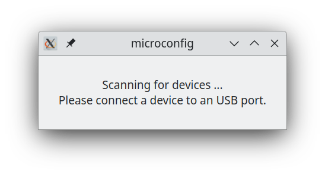
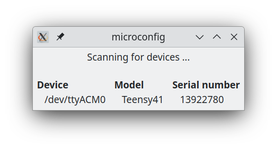
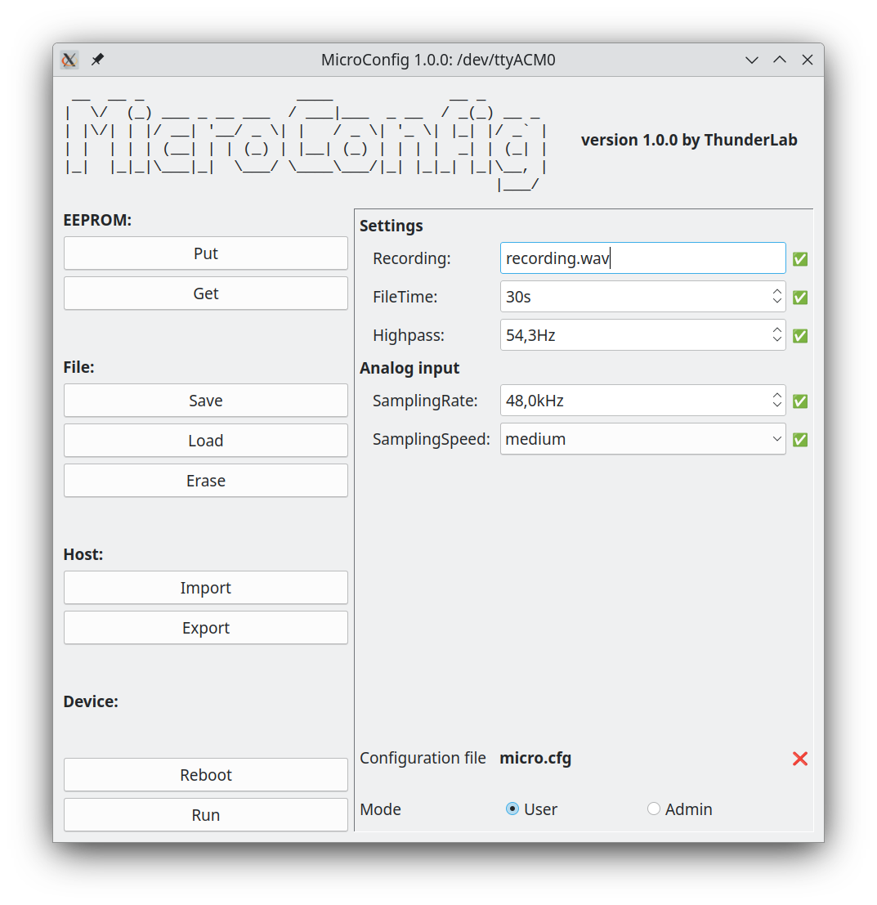
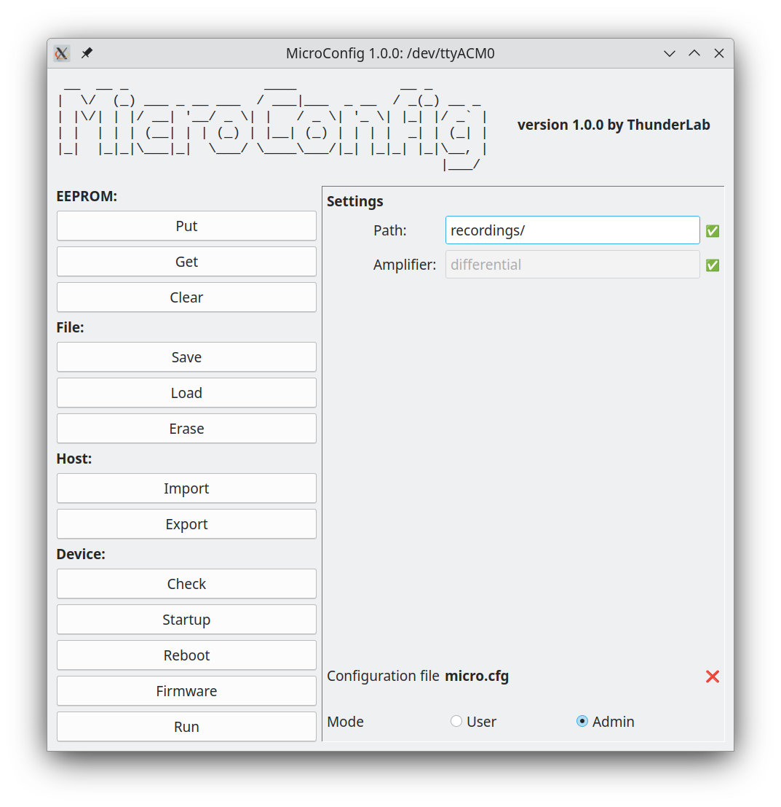

# pymicroconfig

Interacting with a micro controller via a
[MicroConfig](https://github.com/janscience/MicroConfig) menu.

## Installation

First download the
[`MicroConfig`](https://github.com/janscience/MicroConfig) library as
described
[here](https://github.com/janscience/MicroConfig#installation).

Open a terminal (bash, anaconda prompt, Powershell, etc.) and change
into the `pymicrconfig`folder:

Linux and MacOS:
```
cd Ardunio/libraries/MicroConfig/pymicroconfig
```

Windows:
```
cd Documents\Ardunio\libraries\MicroConfig\pymicroconfig
```

Make sure you are in the right python environment and then install the
 package using `pip`:
```
pip install .
```

## Serial monitor

Open a terminal (bash, anaconda prompt, Powershell, etc.) and run
```
serialmonitor
```

It starts scanning for a Teensy to be connected to a serial port/USB:
```
This is serialmonitor from microconfig version 1.0.0, 2025.


Waiting for Teensy device ...
```

Once a Teensy is connected you can interact with it via serial
streams. If you uploaded the [menu sketch](../examples/menu/menu.ino),
this looks like this:
```
- found Teensy41 with serial number 13922780 on /dev/ttyACM0

========================================================
 __  __ _                 ____             __ _       
|  \/  (_) ___ _ __ ___  / ___|___  _ __  / _(_) __ _ 
| |\/| | |/ __| '__/ _ \| |   / _ \| '_ \| |_| |/ _` |
| |  | | | (__| | | (_) | |__| (_) | | | |  _| | (_| |
|_|  |_|_|\___|_|  \___/ \____\___/|_| |_|_| |_|\__, |
                                                |___/ 

version 1.0.0 by ThunderLab
--------------------------------------------------------

ERROR! EEPROM memory corrupted.
Configuration file "micro.cfg" not found or empty.


::::::::::::::::::::::::::::::::::::::::::::::::::::::::
Menu:
    1) Settings ...
    2) Analog input ...
    3) Configuration ...
    4) Firmware ...
    5) Help
    6) Message
    7) Properties
Select: 
```

Now, you may enter a number to select a menu entry.

Once you are done, exit the serial monitor via `Ctrl+C`.


## GUI

Run
```
microconfig
```
and a little window opens, like this



Then connect a Teensy to your computer. The window will list your
Teensy:



At the same time, another windows open (one for each detected Teensy)
that may look like this:



At the right side it presents you with the configuration menu it found
on the microcontroller. You can edit it and any change will be
immediately transfered to the microcontroller.

At the bottom it tells you the name of the configuration file. If it
exist on the microcontroller's SD card a green check mark is displayed
next to it. If the file does not exist, a red cross is displayed.

To the left you find several options you can execute. They all have
keyboard shortcuts with the `Alt`key:

- `Put` (`Alt+P`) writes the configuration to the microcontroller's EEPROM.
- `Get` (`Alt+G`) retrieves the configuration from the microcontroller's EEPROM.
- `Save` (`Alt+S`) writes the configuration to the configuration file on
  the microcontroller's SD card.
- `Load` (`Alt+L`) read the configuration from the configuration file on
  the microcontroller's SD card.
- `Erase` (`Alt+E`) delete the configuration file on the
  microcontroller's SD card.
- `Import` (`Alt+I`) load the configuration from a file stored on
  your computer.
- `Export` (`Alt+X`) save the current configuration to a file on
  your computer.
- `Reboot` (`Alt+B`) reboot the microcontroller.
- `Run` (`Alt+R`) exit the configuration menu and run the code on the
  microconroller. A window opens that keeps showing the serial output
  of the microcontroller.

You may enter `administration mode` by checking `Admin` or typing
`Alt+A` at the bottom right. Then you get access to a few more actions,
and to some special configuration settings, like this:



- `Check` (`Alt+C`) checks whether the configuration you see in the
  GUI really matches the one on the microprocessor.
- `Startup` (`Alt+T`) shows you all messages recorded from the startup
  sequence of the microcontroller, before it entered the configuration
  menu.
- `Firmware` (`Alt+F`) if a `hex` file is found on the
  microcontroller's SD card, the you can upload this new firmware onto
  the microcontroller.

By clicking `User` or typing `Alt+U` you get back into user mode.


## Customizing the GUI

The `pymicroconfig` python package provides the infrastructure to write
your own GUI for interacting with the configuration menu of your
microprocessor based on a
[MicroConfig](https://github.com/janscience/MicroConfig) menu.
You need this if your custom menu provides additional actions.

See [TeeGrid
loggerconf](https://github.com/janscience/TeeGrid/blob/main/utils/loggerconf.py)
for an example. It features displaying and setting the real-time
clock, interacting with the SD card (listing and deleting files,
formatting and erasing the SD card), listing various external chips,
plotting readings from environmental sensors, plotting snippets of
recorded data, etc.


